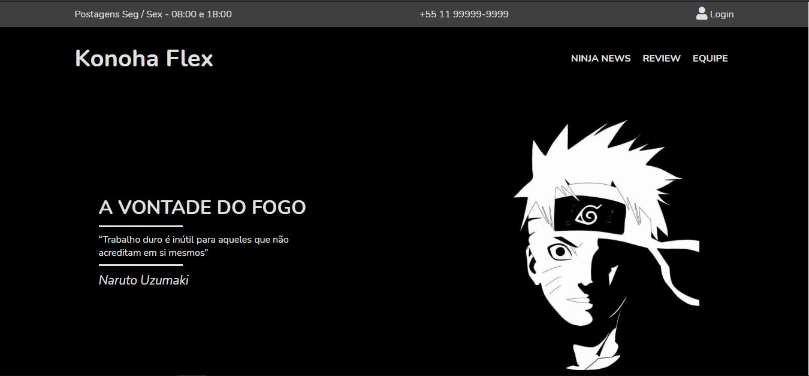

# Konoha Flex

>Website simples de noticias sobre a obra Naruto, criada por Masashi Mishimoto. Desenvolvi o mesmo pois sou muito fã do anime. Coloquei em pratica a criatividade, desenvolvimento de wireframe e programação

## 📝 Licença

Esse projeto está sob licença. Veja o arquivo [LICENÇA](LICENSE) para mais detalhes.

